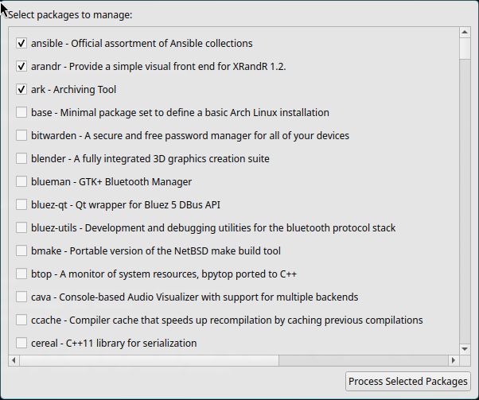

# Pacclean

A simple graphical package manager for Arch Linux that helps you clean up and remove installed packages.

## Overview

Pacclean is a PyQt5-based GUI application that provides an easy way to view and manage installed packages on Arch Linux systems. It displays a list of explicitly installed packages that weren't installed as dependencies, allowing you to select and remove multiple packages at once.

## Features

- Lists all explicitly installed packages (non-dependencies)
- Shows package descriptions for better identification
- Provides a scrollable interface with checkboxes for selection
- Simple one-click removal of selected packages

## Requirements

- Python 3
- PyQt5
- Arch Linux or Arch-based distribution (uses `pacman`)
- Root/sudo privileges (for package removal)

## Installation
1. Clone this repository:
   ```
   git clone https://github.com/ChrisRuff/Pacclean.git
   cd Pacclean
   ```

2. Install required dependencies:
   ```
   pip install PyQt5
   ```

## Usage

Run the application with:

```
python pacclean.py
```

The interface will show:
1. A scrollable list of installed packages with descriptions
2. Checkboxes to select packages for removal
3. A "Process Selected Packages" button at the bottom


Select the packages you want to remove and click the button. The application will generate the appropriate `sudo pacman -R` command for the selected packages.

**YOU MUST RUN THE COMMAND YOURSELF, THIS PACKAGE DOES NOT REMOVE ANY PACKAGES. THIS PACKAGE JUST PROVIDES A UI TO EASIER EXPLORE UNINSTALLABLE PACKAGES**

## How It Works

Pacclean uses `pacman -Qent` to list explicitly installed packages and `pacman -Qi` to fetch detailed information about each package. It presents this information in a user-friendly interface, making it easier to manage your system packages.

## License

MIT

## Contributing

Contributions are welcome! Feel free to submit issues or pull requests.